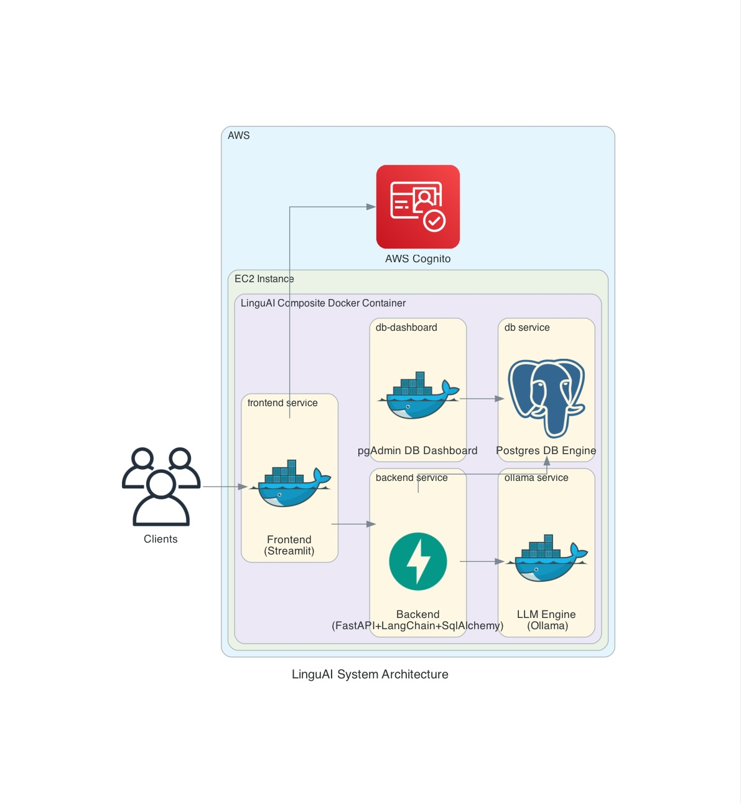

# 1. LinguAI

A containerised language-learning assistant. The stack pairs a NiceGUI +
VMx frontend with a FastAPI + LangChain + SQLModel backend and ships
optional in-container or host-side LLM runtimes (Ollama, OpenAI, Groq)
backed by PostgreSQL.

## 1.1. Architecture

The application is orchestrated by Docker Compose and is composed of five
services:

| Service        | Purpose                                                            |
| -------------- | ------------------------------------------------------------------ |
| `db`           | PostgreSQL 16; loads `db/snapshot/linguai_db_ss.sql` on first boot |
| `db-dashboard` | pgAdmin 4 for browsing the DB                                      |
| `backend`      | FastAPI + LangChain + SQLModel; all routes under `/v1`             |
| `frontend`     | NiceGUI + VMx (strict MVVM); served on the configured `FRONTEND_PORT` |
| `ollama`       | Optional local LLM runtime (omitted in some compose variants)      |

The diagram below renders from [`architecture.py`](architecture.py); see
the source for the regeneration command.



For deeper internal documentation, see the [docs index](docs/README.md),
[backend README](backend/README.md), and [frontend README](frontend/README.md).

## 1.2. Prerequisites

Required:

- Git
- Docker (Engine 24+) with Docker Compose v2

Optional, for working outside the containers:

- Python 3.10
- Poetry (used by both services for dependency management)

## 1.3. Setup

### 1.3.1. Clone

```bash
git clone https://github.com/thekaveh/LinguAI.git
cd LinguAI
```

VMx is a published PyPI dependency (`vmx`, pinned in
`frontend/pyproject.toml`); Poetry resolves it during the frontend build, so
there is no submodule to initialise.

### 1.3.2. Configure environment

Copy the example and fill in any provider keys you intend to use. `.env`
is gitignored.

```bash
cp .env.example .env
```

- `OPENAI_API_KEY` — leave blank to disable OpenAI-backed LLMs.
- `GROQ_API_KEY` — leave blank to disable Groq-backed LLMs.
- `OLLAMA_MODELS` — comma-separated list of Ollama models to pre-pull at
  container start (consumed by `ollama/start.sh`).

The backend's LLM service hides any LLM row whose provider credentials
are absent, so a missing key simply removes that provider's models from
the UI listing.

### 1.3.3. Pick a compose variant

| Compose file                                  | Environment | Ollama source                | Notes                                  |
| --------------------------------------------- | ----------- | ---------------------------- | -------------------------------------- |
| `docker-compose.yml`                          | dev         | containerised (CPU)          | Default; works out of the box          |
| `docker-compose.ollama-localhost.dev.yml`     | dev         | host (`host.docker.internal`)| Faster on Apple Silicon                |
| `docker-compose.ollama-none.dev.yml`          | dev         | none                         | OpenAI / Groq only                     |
| `docker-compose-gpu-nvidia.prod.yml`          | prod        | containerised (NVIDIA GPU)   | EC2 + NVIDIA target                    |

The bare `docker-compose` / `docker compose` command will not find these
non-default files automatically — pass `-f` explicitly.

### 1.3.4. Bring the stack up

```bash
# Default dev stack
docker compose up --build

# Or pick a variant
docker compose -f docker-compose.ollama-localhost.dev.yml up --build
```

The default ports from `.env.example` are:

- Frontend: `http://localhost:50004`
- Backend Swagger UI: `http://localhost:50003/docs`
- pgAdmin (db-dashboard): `http://localhost:50001`

Use `-d` to run detached (logs not streamed); `docker compose logs -f
<service>` to follow logs after the fact.

To tear down the stack while preserving the data volume:

```bash
docker compose down --remove-orphans
```

To drop the data volume too (required to re-apply a snapshot — see §1.4):

```bash
docker compose down -v --remove-orphans
```

### 1.3.5. Default users

The seed snapshot ships a small set of users for local development. All
seeded user passwords are `linguai`; pick any username from the snapshot
to authenticate.

## 1.4. Database

The schema is managed without a migration framework — the file
`db/snapshot/linguai_db_ss.sql` is the source of truth. Postgres' entry-
point loads it from `docker-entrypoint-initdb.d` only when the `db-data`
volume is empty.

To re-snapshot the running DB after schema or data changes:

```bash
docker exec db sh ./scripts/db-snapshot.sh
```

For collaborators to see your schema changes locally, they must drop the
data volume first (`docker compose down -v --remove-orphans`) so the next
`up` reloads the snapshot.

## 1.5. Development

Source trees are bind-mounted into the containers (`./backend` → `/app`,
`./frontend` → `/app/frontend`).
Edits to Python files are picked up live by the backend (uvicorn `--reload`).
The frontend container must be restarted to pick up changes (NiceGUI's
in-process reload is intentionally disabled).

VS Code's *Dev Containers* extension can attach directly to the running
`backend` or `frontend` container if you want an in-container shell with
the venv available.

## 1.6. Running tests

The stack must be up. From the host:

```bash
# Backend
docker exec -it backend python -m pytest app/tests/
docker exec -it backend python -m pytest --cov=app/services app/tests/

# Frontend
docker exec -it frontend python -m pytest tests/
docker exec -it frontend python -m pytest --cov=models/services tests/
```

Run a single file or test with the usual pytest argument syntax
(e.g. `app/tests/user_service_test.py::test_create_user`).

## 1.7. Dependency management

Both services use Poetry. Inside a container:

```bash
# Add a new dependency
poetry add <package>

# Remove one
poetry remove <package>
```

This updates the relevant `pyproject.toml` and `poetry.lock`; commit
both. Rebuild the image afterwards:

```bash
docker compose build
```

## 1.8. Production deployment

The only currently supported production path is an EC2 instance using
the Ubuntu-NVIDIA-PyTorch2 AMI:

```bash
# On the EC2 host, after cloning and configuring .env
docker compose -f docker-compose-gpu-nvidia.prod.yml up --build
```

In production the code is built into the images rather than bind-mounted.
`PROD_ENV_CPUS` and `PROD_ENV_MEM_LIMIT` in `.env` cap the Ollama
container's resources.

## 1.9. Documentation

- [`docs/README.md`](docs/README.md) — entry point to deeper docs: design
  specs, implementation plans, VMx API quickref, audit notes.
- [`backend/README.md`](backend/README.md) — backend layout, layering, DB
  session caveats, LLM provider filtering.
- [`frontend/README.md`](frontend/README.md) — MVVM rules, import-linter
  contracts, page-VM lifecycle, the VMx dependency.
- [`CHANGELOG.md`](CHANGELOG.md) — user-visible changes.
- [`architecture.py`](architecture.py) — source for the diagram above.

## 1.10. License

[MIT](LICENSE).
